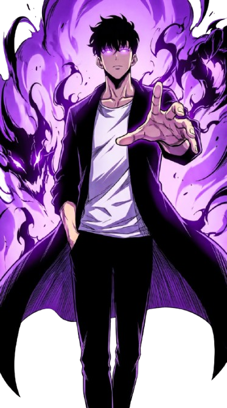

<div align="center">


<a href="https://git.io/typing-svg"></a>

<br/><br/>

<!-- Solo Leveling Themed Contact Channels -->
<a href="https://linkedin.com/in/xeeshan-zs" target="_blank">
  
</a>
&nbsp;&nbsp;
<a href="mailto:zeeshan303.3.1@gmai.com">
  
</a>
&nbsp;&nbsp;
<a href="https://github.com/xeeshan-zs" target="_blank">
  
</a>

<br/><br/>

<h4>:eye: Dungeon Visitors Count</h4>


</div>

---



### :technologist: About Me

> *Exploring the entire CS stack, because a jack of all trades beats a master of one.*

```
[ SYSTEM NOTIFICATION ]
  Player Detected.
  Name   : Zeeshan Sarfraz
  Class  : Comp Sci Victim -> Shadow Monarch
  Rank   : E -> ??? (still leveling)
  Weapon : Keyboard + Coffee
  Stack  : Flutter | React | Next.js | Node.js | Python
  Quest  : Ship code before the deadline
```

<!-- RECENT_REPOS:START -->
- :telescope: Currently grinding on **[tav-2.0](https://github.com/xeeshan-zs/tav-2.0)** -> [https://tavryz.com](https://tavryz.com)
- :crossed_swords: **Recent Quests & Dungeons:**
  - :zap: **[zyfiro](https://github.com/xeeshan-zs/zyfiro)**
  - :zap: **[darzi](https://github.com/xeeshan-zs/darzi)** - mkb darzi
<!-- RECENT_REPOS:END -->
- :seedling: Exploring the **entire CS stack** from frontend to backend to mobile
- :speech_balloon: Ask me about **Flutter, React, Next.js, Node.js, Python, .NET**
- :email: Guild Mail: [zeeshan303.3.1@gmai.com](mailto:zeeshan303.3.1@gmai.com)
- :zap: Fun fact: A jack of all trades beats a master of one

<br clear="right"/>

---

### :hammer_and_wrench: Tech Stack

<div align="center">

#### :globe_with_meridians: Frontend & Mobile


#### :gear: Backend & Languages


#### :cloud: Cloud, BaaS & Databases


#### :toolbox: Tools


</div>

---

### :bar_chart: GitHub Stats

<div align="center">
  
  &nbsp;
  
</div>

<div align="center">
  
</div>

---

### :trophy: Hunter System — Player Assessment

<div align="center">

| Rank Assessment | Status Record | Assessment Value |
| :---: | :--- | :---: |
| :crown: **RANK S** | **Total Contributions** | 2,554+ :zap: |
| :fire: **RANK A** | **Longest Grinding Streak** | 41 Days :dagger: |
| :crystal_ball: **RANK B** | **Conquered Repositories** | 49 Dungeons :scroll: |
| :shield: **RANK C** | **Awakened Hunter Since** | Sep 2024 :hourglass: |
| :zap: **RANK EX** | **Evolution Potential** | Limitless :milky_way: |

<br/>


</div>

---

### :speech_balloon: Random Dev Quote

<div align="center">
  
</div>

---

### :snake: Contribution Snake

<div align="center">
  
</div>

---

<div align="center">
  
</div>